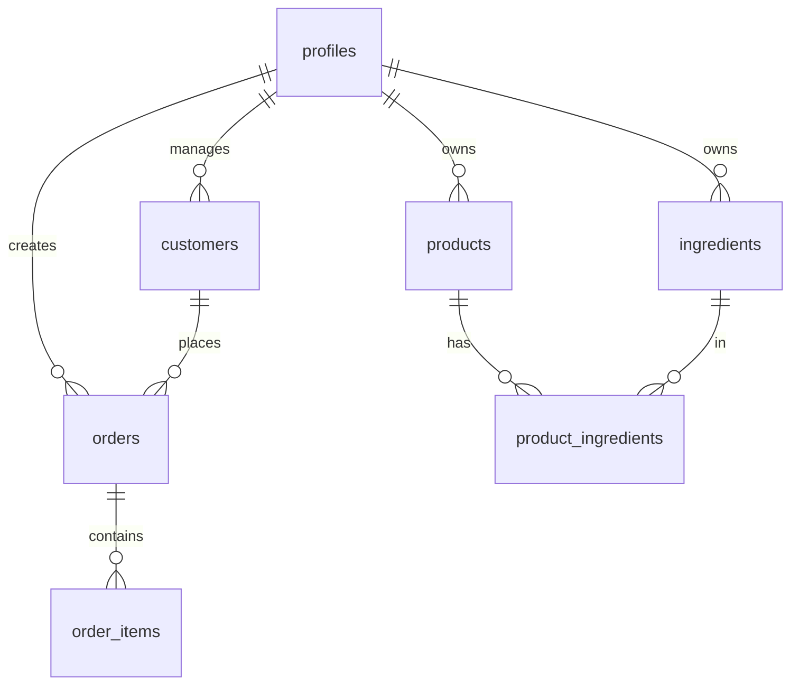

# 🏗️ Arquitetura do Projeto

## Visão Geral

O **Cozinha ao Lucro** é uma aplicação SaaS para gestão de negócios gastronômicos, construída com arquitetura moderna e escalável.

```
┌─────────────────────────────────────────────────────────────────┐
│                         FRONTEND                                 │
│  ┌──────────────┐  ┌──────────────┐  ┌────────────────────────┐ │
│  │   React 18   │  │   Vite 5     │  │    TypeScript 5.5      │ │
│  └──────────────┘  └──────────────┘  └────────────────────────┘ │
│  ┌──────────────┐  ┌──────────────┐  ┌────────────────────────┐ │
│  │ React Query  │  │  shadcn/ui   │  │   Tailwind CSS 3.4     │ │
│  └──────────────┘  └──────────────┘  └────────────────────────┘ │
└─────────────────────────────────────────────────────────────────┘
                              │
                              ▼
┌─────────────────────────────────────────────────────────────────┐
│                         BACKEND (Supabase)                       │
│  ┌──────────────┐  ┌──────────────┐  ┌────────────────────────┐ │
│  │  PostgreSQL  │  │   Auth       │  │    Storage (S3)        │ │
│  └──────────────┘  └──────────────┘  └────────────────────────┘ │
│  ┌──────────────┐  ┌──────────────┐  ┌────────────────────────┐ │
│  │  Realtime    │  │   Edge Funcs │  │    RLS Policies        │ │
│  └──────────────┘  └──────────────┘  └────────────────────────┘ │
└─────────────────────────────────────────────────────────────────┘
```

---

## Stack Tecnológico

### Frontend

| Tecnologia | Versão | Propósito |
|------------|--------|-----------|
| React | 18.3.1 | UI Library |
| Vite | 5.4.1 | Build Tool |
| TypeScript | 5.5.3 | Type Safety |
| TanStack Query | 5.56.2 | Data Fetching & Cache |
| React Router | 6.26.2 | Routing |
| Tailwind CSS | 3.4.11 | Styling |
| shadcn/ui | latest | Component Library |
| Framer Motion | 12.23.24 | Animations |
| React Hook Form | 7.53.0 | Forms |
| Zod | 3.23.8 | Validation |

### Backend (Supabase)

| Serviço | Uso |
|---------|-----|
| PostgreSQL | Database principal |
| Auth | Autenticação/Autorização |
| Storage | Imagens (produtos, avatares) |
| Realtime | Websockets (pedidos, notificações) |
| Edge Functions | Lógica serverless |

### Mobile

| Tecnologia | Versão | Propósito |
|------------|--------|-----------|
| Capacitor | 8.0.0 | Bridge nativo |
| Android SDK | - | Build Android |
| iOS SDK | - | Build iOS |

---

## Estrutura de Diretórios

```
cozinha-ao-lucro/
├── public/                     # Assets estáticos
│   ├── images/                 # Imagens
│   └── ebook_*.pdf             # Lead magnets
│
├── src/
│   ├── components/             # Componentes React
│   │   ├── ui/                 # shadcn/ui primitives (52+)
│   │   ├── sections/           # Landing page sections
│   │   ├── dashboard/          # Dashboard widgets
│   │   ├── orders/             # Gestão de pedidos
│   │   ├── products/           # Gestão de produtos
│   │   ├── customers/          # CRM
│   │   ├── production/         # Painel operacional
│   │   └── subscription/       # Paywall
│   │
│   ├── pages/                  # Route pages
│   │   ├── Index.tsx           # Landing page
│   │   ├── app/                # Dashboard pages
│   │   ├── auth/               # Login/Register
│   │   └── public/             # Menu público
│   │
│   ├── services/               # Business logic (NEW)
│   │   ├── analytics.service.ts
│   │   └── stock.service.ts
│   │
│   ├── hooks/                  # Custom React hooks
│   │   ├── useDashboardMetrics.ts
│   │   ├── use-mobile.ts
│   │   └── use-toast.ts
│   │
│   ├── lib/                    # Utilities
│   │   ├── supabase.ts         # Client config
│   │   ├── database.ts         # CRUD functions
│   │   ├── excel.ts            # Import/Export
│   │   └── utils.ts            # Helpers
│   │
│   ├── contexts/               # React contexts
│   │   ├── AuthContext.tsx
│   │   └── NotificationContext.tsx
│   │
│   ├── types/                  # TypeScript types
│   │   └── database.ts
│   │
│   ├── layouts/                # Page layouts
│   │   └── DashboardLayout.tsx
│   │
│   ├── App.tsx                 # Root component
│   ├── main.tsx                # Entry point
│   └── index.css               # Global styles
│
├── supabase/
│   ├── SCHEMA_COMPLETO.sql     # Database schema
│   └── migrations/             # SQL migrations
│
├── android/                    # Capacitor Android
├── ios/                        # Capacitor iOS
│
├── vite.config.ts              # Build config
├── tailwind.config.ts          # Design tokens
├── tsconfig.json               # TypeScript config
└── package.json                # Dependencies
```

---

## Padrões Arquiteturais

### 1. Component-Based Architecture

```tsx
// Componentes são isolados e reutilizáveis
src/components/
├── ui/              # Primitivos (Button, Input, etc)
├── orders/          # Feature-specific
└── dashboard/       # Domain-specific
```

### 2. Service Layer Pattern

```tsx
// Lógica de negócio extraída dos componentes
src/services/
├── analytics.service.ts   // Cálculos e métricas
└── stock.service.ts       // Gestão de estoque

// Uso:
import { AnalyticsService } from '@/services/analytics.service';
const metrics = AnalyticsService.calculateMetrics(orders, products);
```

### 3. Custom Hooks Pattern

```tsx
// Encapsula lógica reutilizável
src/hooks/
└── useDashboardMetrics.ts

// Uso:
const { metrics, isLoading } = useDashboardMetrics({ period: '7' });
```

### 4. Context Pattern

```tsx
// Estado global compartilhado
src/contexts/
├── AuthContext.tsx        // User session
└── NotificationContext.tsx // Notifications

// Uso:
const { user, profile } = useAuth();
```

---

## Fluxo de Dados

```
┌─────────────┐     ┌──────────────┐     ┌───────────────┐
│   Component │────▶│  React Query │────▶│  database.ts  │
│   (UI)      │     │  (Cache)     │     │  (API Layer)  │
└─────────────┘     └──────────────┘     └───────────────┘
                                                  │
                                                  ▼
                                         ┌───────────────┐
                                         │   Supabase    │
                                         │  (PostgreSQL) │
                                         └───────────────┘
```

### Exemplo de Fluxo

```tsx
// 1. Componente usa hook
function Dashboard() {
  const { metrics } = useDashboardMetrics({ period: '7' });
  return <MetricsCards metrics={metrics} />;
}

// 2. Hook usa React Query
function useDashboardMetrics(filters) {
  const { data } = useQuery({
    queryKey: ['orders'],
    queryFn: () => getOrders(),
  });
  return AnalyticsService.calculateMetrics(data, products);
}

// 3. Query function usa database.ts
export const getOrders = async () => {
  const { data, error } = await supabase
    .from('orders')
    .select('*');
  return { data, error };
};
```

---

## Segurança

### Row Level Security (RLS)

Todas as tabelas têm RLS habilitado com políticas multi-tenant:

```sql
-- Usuário só acessa próprios dados
CREATE POLICY "all_own" ON orders
FOR ALL USING (auth.uid() = user_id)
WITH CHECK (auth.uid() = user_id);
```

### Autenticação

- Supabase Auth (email/password)
- Session tokens (JWT)
- Protected routes via `AuthContext`

```tsx
// Rota protegida
<Route path="/app/*" element={
  <PrivateRoute>
    <DashboardLayout />
  </PrivateRoute>
} />
```

---

## Performance

### 1. Code Splitting

```tsx
// Lazy loading de rotas
const Dashboard = lazy(() => import("./pages/app/Dashboard"));
```

### 2. Materialized Views

```sql
-- Views pré-calculadas para Dashboard
CREATE MATERIALIZED VIEW mv_daily_metrics AS
SELECT user_id, date, SUM(total_value) as revenue...
```

### 3. React Query Cache

```tsx
// Cache de 5 minutos
const queryClient = new QueryClient({
  defaultOptions: {
    queries: { staleTime: 1000 * 60 * 5 },
  },
});
```

### 4. Image Optimization

```tsx
// CDN prefix para imagens
const imageUrl = `${CDN_IMG_PREFIX}${imagePath}`;
```

---

## Database Schema

### Tabelas Principais



### Triggers Automatizados

| Trigger | Tabela | Ação |
|---------|--------|------|
| `tr_order_stock_automation` | orders | Deduz/restaura estoque |
| `tr_order_customer_stats_automation` | orders | Atualiza stats cliente |
| `fn_capture_order_costs` | order_items | Captura custo histórico |
| `on_ingredient_low_stock` | ingredients | Notifica estoque baixo |

---

## Deploy

### Ambiente de Desenvolvimento

```bash
# Instalar dependências
npm install

# Rodar desenvolvimento
npm run dev

# Build produção
npm run build
```

### Ambiente de Produção

```
GitHub → Vercel (auto-deploy on push)
                    │
                    ├── Preview (branches)
                    └── Production (main)
```

### Variáveis de Ambiente

```env
VITE_SUPABASE_URL=https://xxx.supabase.co
VITE_SUPABASE_ANON_KEY=xxx
CDN_IMG_PREFIX=https://cdn.cozinhaaolucro.com
VITE_GA_MEASUREMENT_ID=G-xxx
```

---

## Mobile (Capacitor)

### Build Android

```bash
npm run build
npx cap sync android
npx cap open android
```

### Build iOS

```bash
npm run build
npx cap sync ios
npx cap open ios
```

---

## Contribuindo

Veja [CONTRIBUTING.md](./CONTRIBUTING.md) para guidelines de contribuição.

---

## Referências

- [API Documentation](./API.md)
- [Design System](../src/index.css)
- [Database Schema](../supabase/SCHEMA_COMPLETO.sql)
