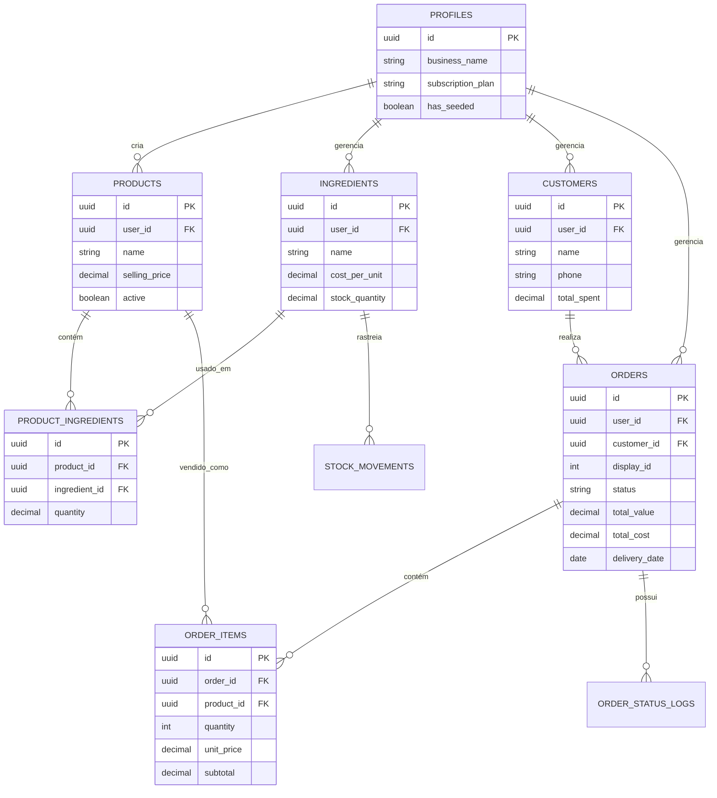

# Documentação do Schema do Banco de Dados

A aplicação utiliza **Supabase** (PostgreSQL) como banco de dados. Este documento descreve as principais tabelas, seus propósitos e relacionamentos.

## Diagrama Entidade-Relacionamento

## Referência das Tabelas

### 1. `profiles`
Armazena informações do usuário e do negócio. Estende a tabela padrão `auth.users` do Supabase.

| Coluna | Tipo | Descrição |
|---|---|---|
| `id` | UUID | Chave Primária, referência `auth.users.id` |
| `business_name` | Text | Nome da empresa/confeitaria |
| `subscription_plan` | Text | 'free', 'pro', ou 'enterprise' |
| `subscription_status` | Text | 'active', 'past_due', 'canceled' |
| `has_seeded` | Boolean | Flag para verificar se dados de demonstração foram carregados |

### 2. `products`
O catálogo principal de itens vendidos pelo usuário.

| Coluna | Tipo | Descrição |
|---|---|---|
| `id` | UUID | Chave Primária |
| `user_id` | UUID | Chave Estrangeira -> `profiles.id` |
| `name` | Text | Nome do produto (ex: "Brigadeiro Gourmet") |
| `selling_price` | Decimal | Preço de venda para o cliente |
| `selling_unit` | Text | Unidade de venda (ex: 'unidade', 'kg') |
| `preparation_time_minutes` | Int | Tempo estimado de preparo |
| `active` | Boolean | Se o produto está disponível para venda |
| `category` | Text | Categoria do produto (ex: 'Doces', 'Bolos') |

### 3. `ingredients`
Matérias-primas usadas para produzir os produtos.

| Coluna | Tipo | Descrição |
|---|---|---|
| `id` | UUID | Chave Primária |
| `user_id` | UUID | Chave Estrangeira -> `profiles.id` |
| `name` | Text | Nome do ingrediente (ex: "Leite Condensado") |
| `cost_per_unit` | Decimal | Custo de compra do ingrediente |
| `unit` | Text | Unidade de medida ('kg', 'l', 'unidade') |
| `stock_quantity` | Decimal | Quantidade atual em estoque |

### 4. `product_ingredients` (Ficha Técnica)
Mapeia quais ingredientes (e quanto) são necessários para cada produto.

| Coluna | Tipo | Descrição |
|---|---|---|
| `id` | UUID | Chave Primária |
| `product_id` | UUID | Chave Estrangeira -> `products.id` |
| `ingredient_id` | UUID | Chave Estrangeira -> `ingredients.id` |
| `quantity` | Decimal | Quantidade do ingrediente usada por unidade de produto |

### 5. `customers`
Banco de dados de clientes.

| Coluna | Tipo | Descrição |
|---|---|---|
| `id` | UUID | Chave Primária |
| `name` | Text | Nome do cliente |
| `phone` | Text | Telefone de contato |
| `total_orders` | Int | Número total de pedidos realizados |
| `total_spent` | Decimal | Valor total gasto acumulado |

### 6. `orders`
Pedidos de venda realizados pelos clientes.

| Coluna | Tipo | Descrição |
|---|---|---|
| `id` | UUID | Chave Primária |
| `display_id` | Int | ID sequencial amigável (ex: #1, #2) |
| `customer_id` | UUID | Chave Estrangeira -> `customers.id` |
| `status` | Text | 'pending', 'preparing', 'ready', 'delivered', 'canceled' |
| `total_value` | Decimal | Preço total de venda do pedido |
| `total_cost` | Decimal | Custo total de produção do pedido |
| `delivery_date` | Date | Data agendada para entrega |
| `delivery_method` | Text | 'pickup' (retirada) ou 'delivery' (entrega) |
| `payment_method` | Text | 'pix', 'credit_card', 'cash', etc. |

### 7. `order_items`
Itens específicos dentro de um pedido.

| Coluna | Tipo | Descrição |
|---|---|---|
| `id` | UUID | Chave Primária |
| `order_id` | UUID | Chave Estrangeira -> `orders.id` |
| `product_id` | UUID | Chave Estrangeira -> `products.id` |
| `quantity` | Int | Quantidade de unidades pedidas |
| `unit_price` | Decimal | Preço no momento da compra (snapshot) |
| `unit_cost` | Decimal | Custo no momento da compra (snapshot) |
